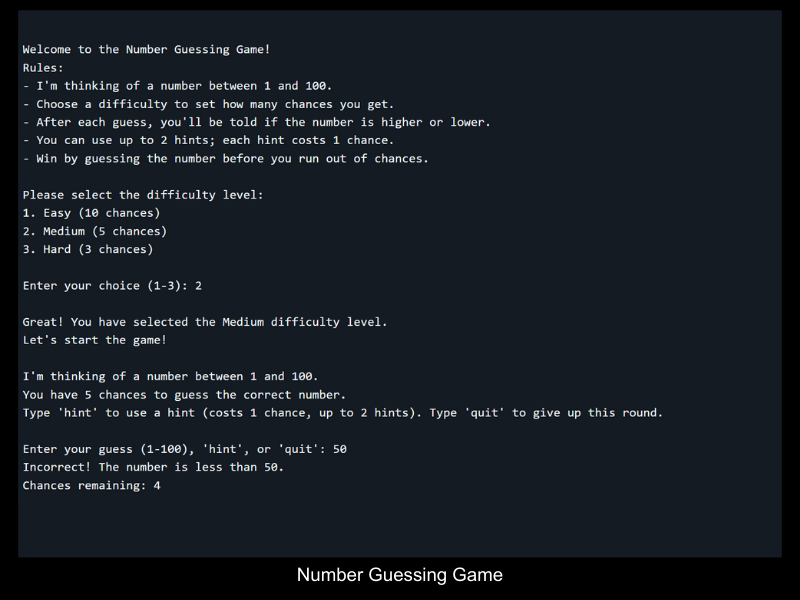

# Backend Projects from Roadmap.sh

This repository contains back-end projects built following the [roadmap.sh](https://roadmap.sh/) developer path.

## Projects List

[Task Tracker CLI](https://roadmap.sh/projects/task-tracker)\
[Github User Activity](https://roadmap.sh/projects/github-user-activity)\
[Expense Tracker](https://roadmap.sh/projects/expense-tracker)\
[Number Guessing Game](https://roadmap.sh/projects/number-guessing-game)\
[Unit Converter](https://roadmap.sh/projects/unit-converter)\
[Blogging Platform API](https://roadmap.sh/projects/blogging-platform-api)\
[TMDB CLI Tool](https://roadmap.sh/projects/tmdb-cli)

Click any of the images below to view the readme and live demo of the project.

  
  

  
  
  

  
  
 

  
 

